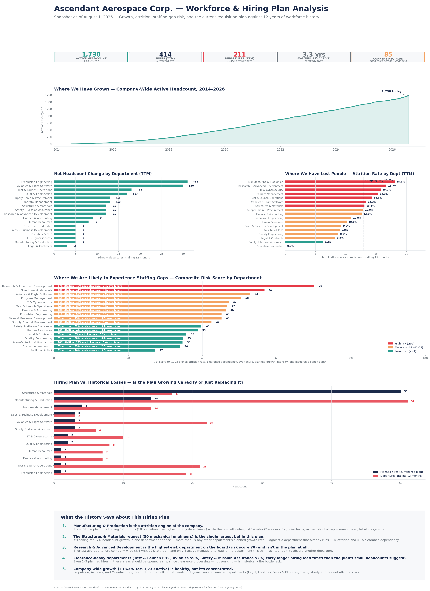

# Ascendant Aerospace — Employee Dataset & Workforce Dashboard

A fully synthetic HR/People Analytics dataset for a fictional commercial
aerospace/launch-vehicle company, plus the pipeline that turns it into a
single-image workforce dashboard for hiring-plan decisions.

**No real people, companies, or HR records are used anywhere in this
project.** Every name, employee ID, and record is procedurally generated.



## What's here

| Path | Purpose |
|---|---|
| `data/employees.csv` | The generated dataset — 2,500 synthetic employees, 28 columns |
| `data_generation/` | Generates `employees.csv` from scratch |
| `dashboard/` | Reads `employees.csv` and renders the dashboard PNG above |
| `ascendant_aerospace_workforce_dashboard.png` | The rendered dashboard |

Both halves are independent Python projects — regenerate the dataset,
edit the hiring plan, or rebuild the dashboard without touching the other.

## Quick start

```bash
git clone https://github.com/KyleColby-Analyst/Employee-Dataset.git
cd Employee-Dataset
```

**1. Generate the dataset** (skip this if you just want to use the
committed `data/employees.csv` as-is):

```bash
cd data_generation
python3 -m venv venv
source venv/bin/activate      # Windows: venv\Scripts\activate
pip install -r requirements.txt
python3 Generate_Employees.py
```

Writes `employees.csv` to `data_generation/data/`. Copy it into `../data/`
if you want it to replace the committed version.

**2. Build the dashboard:**

```bash
cd ../dashboard
python3 -m venv venv
source venv/bin/activate
pip install -r requirements.txt
python3 build_dashboard.py --input ../data/employees.csv --output ../ascendant_aerospace_workforce_dashboard.png
```

**3. Run the tests** (either project):

```bash
pytest tests/ -v
```

> **Using a Mac with Homebrew Python?** You'll likely hit
> `error: externally-managed-environment` on a bare `pip install`. The venv
> steps above avoid that entirely — just make sure `(venv)` is showing in
> your terminal prompt before running `pip` or `python3`, and re-activate it
> (`source venv/bin/activate`) any time you open a new terminal.

## The dataset

One row per employee: identity, department/title/level, compensation,
security clearance, performance, engagement, and attrition outcome — all
correlated on purpose (pay scales with level and department, attrition
risk scales with tenure/performance/engagement, clearance need is
department-dependent) so it supports real analysis instead of being pure
noise. Full column reference and generation logic are documented in
[`data_generation/README.md`](data_generation/README.md).

## The dashboard

Single PNG covering four questions against the current hiring
requisition plan:

- **Where have we grown?** — company-wide headcount trend, 2014–present
- **Where have we lost people?** — attrition rate by department, trailing 12 months
- **Where are we likely to see staffing gaps?** — a composite risk score blending
  attrition rate, clearance dependency, average tenure, planned-growth intensity,
  and management bench depth
- **What should this tell the hiring plan?** — planned hires vs. historical
  losses by department, plus five takeaways computed directly from the
  data (not hardcoded — a refreshed dataset or revised plan produces
  updated takeaways automatically)

The hiring plan itself is a set of job requisitions mapped to the
dataset's departments; see [`dashboard/hiring_plan.py`](dashboard/hiring_plan.py)
for the mapping and the judgment calls behind it. Full pipeline details
are in [`dashboard/README.md`](dashboard/README.md).
